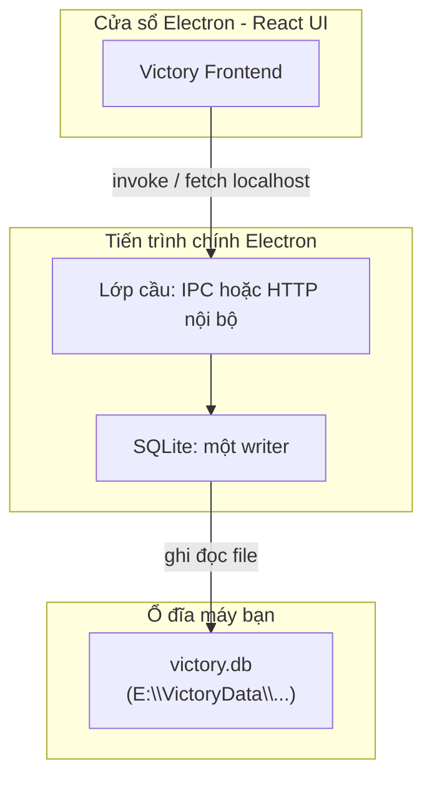

# Thiết kế: Electron App → ghi trực tiếp SQLite → file `.db` trên máy

Luồng bạn mô tả:

```text
Electron App
     ↓
Ghi trực tiếp SQLite
     ↓
File .db nằm trên máy của tôi
```

Dưới đây là thiết kế kỹ thuật để luồng này **đúng nghĩa**: dữ liệu không chỉ “trên trình duyệt”, mà **một file cơ sở dữ liệu thật** nằm ở đường dẫn bạn chọn (ví dụ ổ **E:**).

---

## 1. Nguyên tắc

| Nguyên tắc | Giải thích |
|------------|------------|
| **Một nơi ghi SQLite** | Chỉ **một tiến trình** mở file `.db` ở chế độ ghi (hoặc một connection pool trong cùng tiến trình). Tránh hai tiến trình cùng ghi một file SQLite. |
| **Renderer không mở file** | Cửa sổ React (renderer) **không** đọc/ghi file `.db` trực tiếp. Chỉ gọi **IPC** hoặc **HTTP tới localhost** tới lớp đã tin cậy. |
| **Đường dẫn `.db` cố định, người dùng cấu hình** | Ví dụ `E:\VictoryData\victory.db` — lưu trong cấu hình app (file JSON cạnh app hoặc registry), không hardcode nhánh mã nguồn. |

---

## 2. Luồng dữ liệu (chi tiết)



- **Electron App**: cửa sổ + menu + vòng đời ứng dụng.
- **Ghi trực tiếp SQLite**: thực hiện trong **main process** (hoặc **một** tiến trình Node con do main quản lý — xem mục 3).
- **File `.db`**: đường dẫn tuyệt đối do bạn đặt; file tồn tại độc lập, có thể sao chép/backup như mọi file.

---

## 3. Hai cách triển khai “ghi trực tiếp” (chọn một)

### Cách A — SQLite trong Main (ghi thật sự trực tiếp nhất)

- Dùng `better-sqlite3` (native) trong **main**.
- API: `ipcMain.handle('db:exec', …)` / `('db:query', …)`.
- **Ưu**: Không cần server HTTP; độ trễ thấp.  
- **Nhược**: Logic hiện tại dùng **Prisma** ở backend phải **viết lại** một phần (SQL thuần hoặc lớp repository), hoặc gọi Prisma chỉ từ main (cấu hình phức tạp hơn trong Electron).

### Cách B — Một tiến trình Node (backend hiện tại) + `DATABASE_URL` trỏ file local *(khuyến nghị với repo Victory hiện tại)*

- **Main** khởi chạy **một** instance Express + Prisma (code `backend/`), trước khi mở cửa sổ.
- `process.env.DATABASE_URL=file:E:/VictoryData/victory.db` (hoặc đường dẫn đọc từ cấu hình).
- Renderer dùng `fetch('http://127.0.0.1:PORT/...')` như hiện tại (đã có `/api/state`, `/api/tax/gtgt01/data`, …).
- **Ưu**: Giữ nguyên Prisma, migration, API. **Một writer** = một server.  
- **Nhược**: Không phải “SQLite trong renderer”, nhưng **file `.db` vẫn nằm trên máy bạn** và mọi ghi đều đi vào file đó — đúng luồng bạn yêu cầu về mặt dữ liệu.

> Với sản phẩm kế toán đã có backend Node, **Cách B** thường nhanh và ít rủi ro hơn. **Cách A** phù hợp nếu sau này muốn bỏ hẳn HTTP nội bộ.

---

## 4. Vị trí file `.db` trên ổ E:

1. Lần đầu chạy app: hỏi hoặc gợi ý `E:\VictoryData\`, tạo thư mục nếu chưa có.
2. Lưu đường dẫn vào `userData/config.json` (hoặc `electron-store`).
3. Trước khi khởi động backend: `DATABASE_URL=file:${encodeURI(path)}` (Windows: chú ý slash `/` trong URL Prisma).

---

## 5. Bảo vệ và sao lưu

- **Backup**: định kỳ copy `victory.db` (app đã có hướng `AUTO_DB_BACKUP_HOURS` + zip — xem `TAX-FILING-STORAGE.md`).
- **Không mở cùng lúc hai app** trỏ cùng một file `.db` (WAL có thể dùng chế độ đọc, nhưng hai writer vẫn nguy hiểm).

---

## 6. Tóm tắt một dòng

**Electron** chỉ là vỏ; **SQLite** là nguồn sự thật trên đĩa; **một lớp duy nhất** (main + native driver *hoặc* backend Node nhúng) **ghi trực tiếp** vào `victory.db` tại đường dẫn bạn chọn (ví dụ **E:**).
